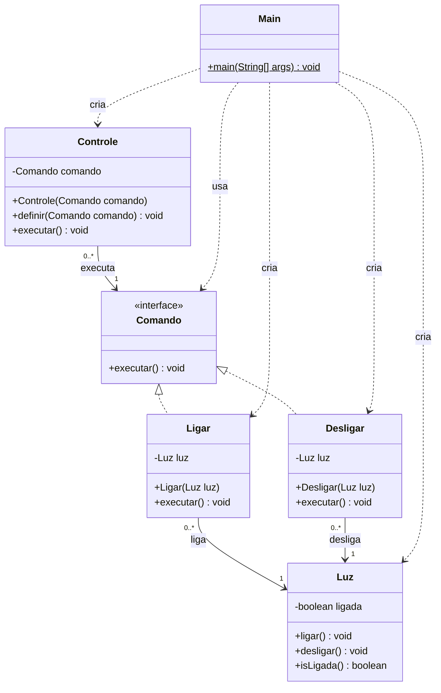

```mermaid
classDiagram
    class Comando {
        <<interface>>
        +executar() void
    }
    class Luz {
        -boolean ligada
        +ligar() void
        +desligar() void
        +isLigada() boolean
    }
    class Ligar {
        -Luz luz
        +Ligar(Luz luz)
        +executar() void
    }
    class Desligar {
        -Luz luz
        +Desligar(Luz luz)
        +executar() void
    }
    class Controle {
        -Comando comando
        +Controle(Comando comando)
        +definir(Comando comando) void
        +executar() void
    }
    class Main {
        +main(String[] args)$ void
    }

    Comando <|.. Ligar
    Comando <|.. Desligar
    Controle "0..*" --> "1" Comando : executa
    Ligar "0..*" --> "1" Luz : liga
    Desligar "0..*" --> "1" Luz : desliga
    Main ..> Luz : cria
    Main ..> Comando : usa
    Main ..> Ligar : cria
    Main ..> Desligar : cria
    Main ..> Controle : cria
```
